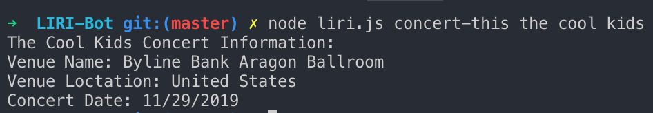
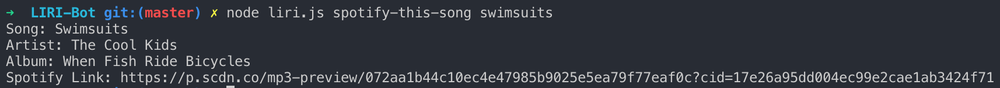
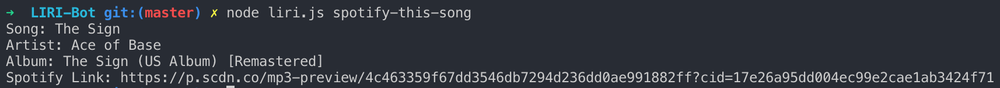
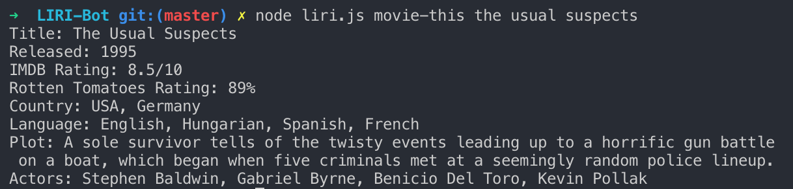
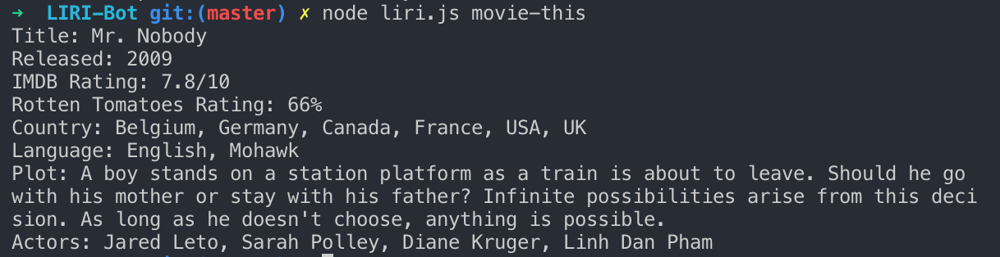
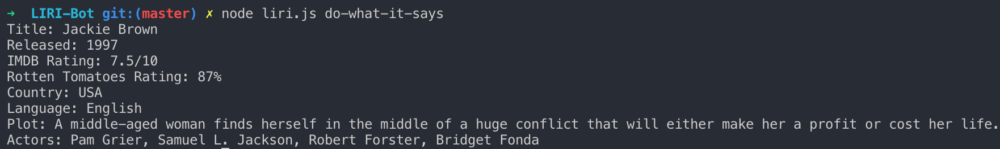

# LIRI-Bot

### University of Texas at Austin Coding Bootcamp: Homework 8

LIRI Bot is a Language Interpretation and Recognition Interface. This program will take in user inputs from the command line and return information based on four predetermined key words: *concert-this, spotify-this-song, movie-this, and do-what-it-says*. 

**concert-this**, along with an *artist name*, will provide the user with the venue name, location, and date of said artist's next concert. 

**spotify-this-song**, along with a *song title*, will provide the user with the artist name, song name, album name, and a preview link of the song from Spotify. 

If no user input is provided, the program will return information for Ace of Base.

**movie-this**, along with a *movie title*, will provide the user with information about the movie from OMDB. 

If no movie name is provided, the program will return information for Mr. Nobody.

**do-what-it-says** requires no second user input, and will take information from a txt file (random.txt) and run the appropriate function. For example, if the txt file contains "movie-this, jackie brown", the movie function will be run for Jackie Brown.

Give a high-level overview of how the app is organized

This application utilized Javascript, Node.js (Node-Spotify-API, Axios, Moment, and DotEnv), and several APIs (Bands in Town, Spotify, OMDB).
